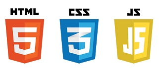

# Bouncing balls

## App is hosted [here](https://kristian-mkd.github.io/bouncing-balls/)

## Used technologies

## Used third party library [p5.js](https://p5js.org/)
 - it is used only for drawing of the balls on the screen
 - used methods: 
   - [setup()](https://p5js.org/reference/#/p5/setup) invoked on startup to initialize the app
   - [createCanvas()](https://p5js.org/reference/#/p5/createCanvas) creates the canvas on which the balls are drawn
   - [background()](https://p5js.org/reference/#/p5/background) sets the background color of the canvas and to prepare the blank canvas for each new draw iteration
   - [fill()](https://p5js.org/reference/#/p5/fill) sets the color used to fill shapes
   - [elipse()](https://p5js.org/reference/#/p5/ellipse) draws circles on the canvas

## Tests
 - Jasmine is used to as testing framework
 - There are unit test for the ball addition, movement, collision and gravity force.

## Potential improvements

 - can be rewritten using Typescript, using latest JS, so modern features can be used as modules, classes to improve the code quality 
 - module bundler can be used (Webpack) instead of adding the scripts manually
 - global vars should be encapsulated and used only for the main state of the app
 - more unit tests can be added
 - dynamically resizable canvas to take up whole screen on different devices
 